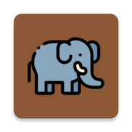

<!-- PROJECT SHIELDS -->
[![CC0-1.0 License][license-shield]][license-url]

<!-- PROJECT LOGO -->
<p align="center">
    <a href="https://github.com/dagonco/flutter_savage_workshop">
        
    </a>
    <h3 align="center">Savage</h3>
    <p align="center">A app to learn the simplest Flutter widgets and how to use them.</p>
    <br/>
</p>


<!-- ABOUT THE PROJECT -->
## About the Project

This project serves as a guide for me to carry out about 19 exercises to understand the operation of the different widgets, their properties and attributes.

Distributed in 10 branches that starts from `step_0` from the creation of the project to `step_3_2` where we will end our workshop. In the `master` branch is where we will find the project fully resolved so that it can serve as a guide to solve any problem during an exercise.

<!-- GETTING STARTED -->
## Getting Started

### Installation

1. Clone the repo
```
git clone git@github.com:dagonco/flutter_savage_workshop.git
```
2. Start from step_0
```
git checkout step_0
```


<!-- LICENSE -->
## License

Distributed under the CC0-1.0 License. See `LICENSE` for more information.

<!-- MARKDOWN LINKS & IMAGES -->
[license-shield]: https://img.shields.io/github/license/dagonco/flutter_savage_workshop
[license-url]: https://github.com/dagonco/flutter_savage_workshop/blob/master/LICENSE